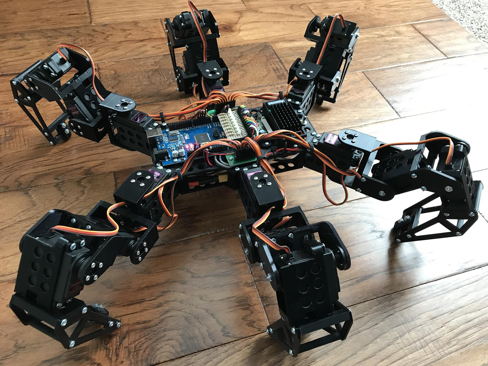

# Hexapod - Markwtech (PhantomX clone)

## Resources, tutorial, parts

- **Dir**: Hobby/Robotika/Hexapod - Markwtech/
- **Thingiverse** [dily k tisku](https://www.thingiverse.com/thing:3463845)
- **Project page:** [markwtech - sestaveni, dily](https://markwtech.com/robots/hexapod/)

- **Dalsi hexapod projekty s vysvetlenim, vypocty a tak**:
  - [hexyrobot](https://hexyrobot.wordpress.com/)

## Motivation videos, inspiration

- [PhantomX AX Metal Hexapod Mark III](https://www.youtube.com/watch?v=8v16kpBj9JQ)
- [PhantomX running Phoenix code](https://www.youtube.com/watch?v=rAeQn5QnyXo)

## Parts list

- 1x Raspberry Pi 4B
- 2x PCA9685 Servo Driver
- 18x MG996R (Power Pro)
- 72x  M2x6
- 18x  M3x8
- ?x M2.5x8
- ?x M2.5x10

## STL parts (Nektere nahradit upravenymi, mnou vyrobenymi a pod.)

### Body parts

- 1x Top body plate
  - !! **My modified version for rpi**
- 1x Bottom body plate
- 18x Servo Case
- 3x Left zahnuty joint
- 3x Right zahnuty joint
- 6x Zahnute joint - druha strana
- 12x Spolecny nezahnuty joint
- 12x Spolecny nezahnuty joint - druha strana
- 3x Left placata vec
- 3x Right placata vec
- 12x Pulka konce nohy
- 6x Spicka nohy        (Flexible filament!)
- 6x Tycinka spacer
- 6x Upevneni nohy k telu
- 6x Placata vec na upevneni spicky konce nohy
- 18x Lozisko placeholder

### Stojanek

- 1x Top stand part
- 1x Bottom stand part
- 8x Stand tycky

## Sestaveni

### Napajeni

- 5V, 2.5A: Raspberry pi, PCA9685 Servo Driver chip, ...
- 5V, 30+Amp: Servos (PCA9685 blue terminal) (18 * MG996R 2.5A)
- 4xAA nebo 5AA. Zkusit a zjistit, ktere bude lepsi.

Which batteries to use:

- Use High-Capacity NiMH or NiCads
- It is also **not recommended** to mix/match batteries of different power levels or types. Recommendation: Powerex 2700mAh Rechargeable Batteries
- Do Not Use Alkaline Batteries (Not enough current)
- Do Not Use Lipo Batteries (Ttheir voltage is either high enough to damage the servos (7.4v) or too low to be effective (3.7v). Can be mitigated with voltage converter)

Another considerations and issues:

>##Use a power supply on the logic input if Hexy is not connected to USB
> Hexy comes with a bluetooth-serial adapter. You can use this adapter to control your Hexy from a bluetooth-enabled device. However, using on the servo battery pack, the voltage can sometimes dip too low for the electronics and reset Hexy (see Servo-Battery-only Reset below for specifics). The solution is to use an extra power supply on the logic power input socket. You can use a 9v battery, 4xAA or 5xAA. You can place both a 9v battery and 4xAA battery case for remote usage underneath hexy, or if you are using the 5xAA case, you can place the 9v ontop of the servotor32 board.
>
>##Operating Hexy remotely without a logic power supply causes issues
>
> If you’re powering Hexy off of battery power only (Say, running it on bluetooth), Hexy can sometimes start to move, then suddenly lose all servo power, then reset and begin this cycle all over again. This is caused by the voltage ‘dipping’ too low. When the servos move, they draw power from the batteries and thus lowering the battery voltage. If this voltage goes too low the Servotor32, Hexy’s ‘brain’, doesn’t get enough voltage to keep going and resets. The reset causes the servos to stop getting signals, stop moving, and the voltage goes back up enough to let the controller boot up. But as soon as Hexy starts moving again, the voltage dips, and it starts all over again.
>
> The fix is to power the brain from an extra power source, one that will have a high enough voltage that in case the battery dips too low, it has a backup supply to keep going. This can be seen as the ‘logic’ power supply port on the controller. a 4xAA, 5xAA or 9v battery pack plugged into this port will work, and keep hexy going no matter how low the servo voltage dips. The USB power supplied when plugged into a computer works as well, and this problem won’t occur when Hexy is plugged in.
>
>##External Power Supply
>
>Hexy can be externally powered with any power supply that maintains a constant 5v and a minimum of 5amps. Here are some places you can purchase one:

Mouser

Adafruit