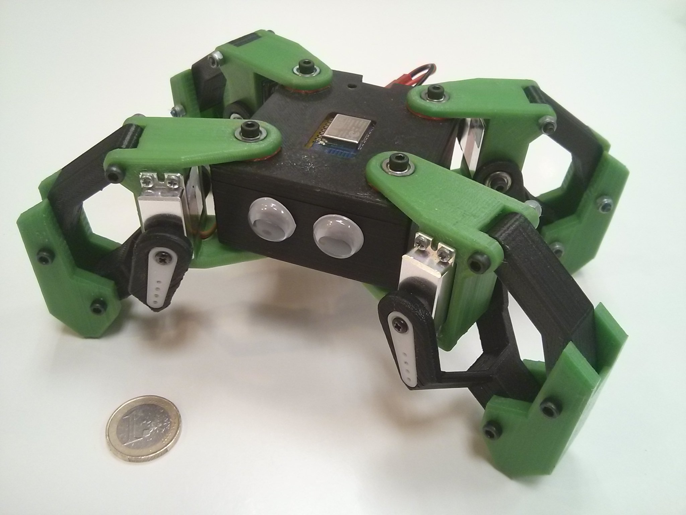

# Kame quadpod

**Rejstrik**:

- [1. STL, videa, project pages](#1-stl-videa-project-pages)
  - [1.1. Examples](#11-examples)
  - [1.2. Project pages](#12-project-pages)
- [2. Seznam materialu a soucastek k tisku](#2-seznam-materialu-a-soucastek-k-tisku)
  - [2.1. STL list](#21-stl-list)
  - [2.2. Dily](#22-dily)
- [3. Zapojeni a sestaveni](#3-zapojeni-a-sestaveni)
  - [3.1. Zapojeni a sestaveni](#31-zapojeni-a-sestaveni)
    - [3.1.1. Pro Arduino](#311-pro-arduino)
    - [3.1.2. Finalni Zapojeni a sestaveni (ESP32)](#312-finalni-zapojeni-a-sestaveni-esp32)
  - [3.2. Programovani](#32-programovani)
    - [3.2.1. Arduino IDE required libraries](#321-arduino-ide-required-libraries)

## 1. STL, videa, project pages

### 1.1. Examples

- **Dir**: Hobby/Robotika/Kame/
- **Dir**: Hobby/3D Printing models/Robotika/Kame - quadruped robot
- 

### 1.2. Project pages

- Thingiverse: [Kame: 8DOF small quadruped robot](https://www.thingiverse.com/thing:1265766)
- [Project page: Kame quarduped robot](https://hackaday.io/project/9334-kame-esp8266-based-quadruped)

---------------------------------------------------------------------------------------------

## 2. Seznam materialu a soucastek k tisku

### 2.1. STL list

- TODO: Pridat modifikovane dily pro horni kameru, prostor pro ESP, a pod
- [ ] 1x bodyamod (modified for SG90 servo)
- [ ] 1x bodybmod (modified for SG90 servo)
- [ ] 2x leftbracket (modified for SG90 servo)
- [ ] 2x rightbracket (modified for SG90 servo)
- [ ] 2x leftgb (modified for SG90 servo)
- [ ] 2x rightgb (modified for SG90 servo)
- [ ] 1x Untitled
- [ ] 1x Montaj2-front-frame-1

### 2.2. Dily - Mechanicke

- [ ] 9x Small servo 9g SG90
- [ ] 12x M3\*30mm + maticky
- [ ] 8x Lozisko F693ZZ Flange Bearing 3x8x4 mm
- [ ] Wires

### 2.3. Dily - Elektro

- [ ] ESP-wroom32 (WiFi + Bluetooth)
- [ ] Baterie Lipol 1200MAh 3.7V
- [ ] PCA9685 Servo Controller
- [ ] Step-up booster (3.7V -> 5V)
- [ ] 3v3 voltage regulator (3.7V -> 3.3V)
- [ ] 470uF - 1000uF Capacitor

### 2.3. Rozsireni (Extensions)

- [ ] Battery indicator
- [ ] HC-SR04 - Ultrasonic distance sensor
- [ ] Adafruit PowerBoost 500C - Nabijeni baterie a napajeni MCU
- [ ] (ESP camera modul)
- [ ] LED to the front and back
- [ ] LED into the top mount head as a flashlight

### 2.4. Dropped

- [ ] TB4056 Li-Po battery charger

---------------------------------------------------------------------------------------------

## 3. Zapojeni a sestaveni

- Nutne ESP32 (ESP-wroom32, ...) kvuli podpore BL (a ne pouze BLE)
- Nelze pouzit knihovnu PS4Controll s ESP-8266, protoze to podporuje pouze Low-Energy BT
- Ovladani pres Controller nakonec skrze knihovnu Bluepad32
- Nutno zvolit 'board' z "rodiny" bluepad32.

### 3.1. Poznamky k zapojeni

- Hlidat si required Voltage u senzoru, esp a pod (3v3 vs 3.7V z baterie, a pod!!!)
- Nutno ESP32. Pro ESP8266 neni PS4Controll knihovna kompatibilni!
- Tluste draty pro propojeni baterie az k V+ u PCA9685 - bo vyssi current.
- Capacitor mezi V+ a GND u PCA9685 (current balancing because of spikes from active servos)
  - cca 100uF na 1 servo -->
  - --> 9 serv -> ~900uF
- ??? Pull-up rezistory mezi 3v3 a (SCA a SDL)

### 3.2. Setup a Programovani

#### 3.2.1. Required libraries (Arduino-IDE)

- **How to add library**:
  - `Sketch -> Manage Libraries -> search`

- **Libraries**:
  - Adafruit_PWMServoDriver.h
  - Bluepad32.h

#### 3.2.2. Board selection

- **Board**: ESP32-WROOM-DA Module (esp32-bluepad32:esp32:esp32da)
- IDE -> Tools -> Board -> esp32_bluepad32 -> ^^^

#### 3.2.3. Controller pairing

- **XBox controller + Bluepad32**
  - 1. Just turn on the xbox controller with the large middle button.
  - 2. Press pairing (in the front side of controller to turn on pairing mode)

- (**PS4 controller + PS4Controller.h**)
  - Nekompatibilni s XBox controllerem
  - Neslo rozchodit s tim Frog Controllerem z Aliexpressu.

#### 3.2.4. Writing to ESP

- ! Hold right button of ESP (usb at the bottom) during "Connecting......." phase.

### 3.3. Updates

#### 3.3.1. Removed TP-4056 battery charger

- Proc?
- Max current output: 3A

---------------------------------------------------------------------------------------------

## 4. Troubleshooting

### 4.1. A fatal error occurred: Failed to connect to ESP32: Wrong boot mode detected (0x13)! The chip needs to be in download mode

- Right after compilation, before flashing, hold BOOT/FLASH button.
  - Kdyz mame ESP tak, ze je USB port dole, tak je to to napravo.

- 1. Zacit drzet behem "Connecting ......"
- 2. Pustit, kdyz zacnou "Writing at 0x00s0f0f0dd0 (x %)"

https://support.aimagin.com/boards/9/topics/689