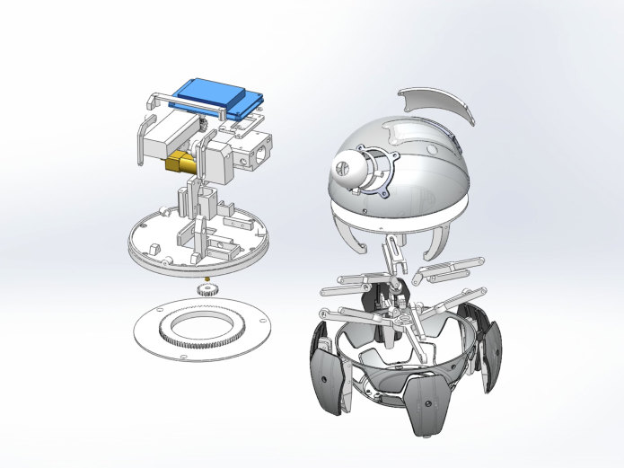

# Xpider Ballsy

## 1. STL, videa, project pages

- Phone: Arduino ESP Bluetooth - Dabble app
- 3D printer
- ESP32-C3 mini
- Arduino IDE

### 1.1. Videos

- [Xpider design](https://www.youtube.com/watch?v=K1jtuKZg11o)
- 

### 1.2. Project pages and resources

- [Thingiverse: Xpider Ballsy](https://www.thingiverse.com/thing:1704879)
- [Cults3D: Xpider Ballsy](https://cults3d.com/en/3d-model/game/xpider-code-name-ballsy)
- [Facebook: Xpider](https://www.facebook.com/smallxpider/)
- [Funding campaign on indiegogo: Xpider cutest robot](https://www.indiegogo.com/projects/xpider-world-s-cutest-spider-robot#/)
- [Xpider parts, description](https://hackaday.io/project/18149-xpider-worlds-cutest-spider-robot)
- [Xpider-E(original name QPAKO)](https://community.robotshop.com/forum/t/xpider-e-original-name-qpako-my-1st-walking-creature/31423)
- [instructables.com: Ballsy instructions](https://www.instructables.com/Xpider-the-Smallest-Smart-Robot-Spider-in-the-Worl/)
- [Official Youtube Channel for XPider](https://www.youtube.com/@xpiderroboeve7123)

### 1.3. Basic info - original version

* Actuators / output devices: 2 motors, one servo
* Control method: Bluetooth, WiFi, Phone, Web browser
* Operating system: Linux
* Power source: 7.4V Lipoly
* Programming language: C++, C, javascript
* Sensors / input devices: IR, ultrasonic, camera
* Target environment: indoor, outdoor, anywere not near water

### 1.4. My version - Features

- UI web interface
- LED will blink last 3 digits of IP address (192.168.0.xxx) after start
- Click - robot turns to that direction and walks few cm distance.
- Turn left/right
- Walk forward/backward
- Move eye up/down
- Control LED

---------------------------------------------------------------------------------------------

## 2. Seznam materialu a soucastek k tisku

### 2.1. STL list

- [ ] Vse ve slozce v Hobby/Robotika/Xpider-Ballsy
- [ ] + custom modifikace

### 2.2. Screws, tools

- [ ] 30x M1,6\*12mm
- [ ] Baterie Lipol 3.7V 600 MAh
- [ ] ESP32-C3 super mini
- [ ] TB6612FNG Dual H-Bridge motor driver
- [ ] 2x N20 300 RPM motor (Bez encoderu!)
- [ ] Gumove placky na prilepeni na nozicky
- [ ] LED
- [ ] 2x Keramicke kapacitory 0.1uF
- [ ] LDU 3.7V to 5V
- [ ] (TB4056 battery charger)
- [ ] (Switch)

---------------------------------------------------------------------------------------------

## 3. Sestaveni

- Napajet k motorum keramicky Capacitor
- Na nozicky pridelat gumove podlozky, aby neklouzaly

### 3.1. Build Timeline Diary

Od nejnovejsiho.

- 2025-06-05
    - FINISH!
    - Vse narvano do tela.
    - LED v oku (On/OFf)
    - Web UI
    - Videa, jak chodi na stole a na posteli. Zari cervene LED oko. ZIJE!!!
    - Zapojeni 2 baterii do serie -> 7.4V napajeni (Placate 1C baterie! Ted bych pouzil lepsi).

- 2025-06-04
    - Testovani spravneho zapojeni (nepajive pole, esp32-mini-c3, h-bridge)
    - Takze je zatim rozkuchan na stole (elektronika porad venku)
    - Xpider chodi a toci se.
    - Vyresil jsem ten chybejici dilek, ktery zpusoboval, ze se vrsek oddelaval nahoru pri chuzi.

- 2025-05-23
    - Testovani spravneho zapojeni (nepajive pole, esp32-mini-c3, h-bridge)
    - Pripajeni ESP a Bridge na pajive pole kvuli kompaktnosti. (Nakonec nepouzito, protoze jsem to rozbil nejak)

- 2023-11-13
    - Learning with the electro-motors and Motor driver Bridge
    - Arduino + nepajive pole + H-Bridge a motory

- 2023-04-26
    - Zkompletovani celeho tela

- 2023-04-08
    - Tisk diluu a zjistovani, jak to sestavit

---------------------------------------------------------------------------------------------

## 4. Programovani

- **MCU**: ESP32-c3 supermini
  - pozor, nepodporuje standardni bluetooth, pouze LE (low energy)
    - Tim padem Bluepad32 library nefunguje -> nelze ovladat BT ovladacem.

- **Board:**
  - **MakerGO ESP32 C3 SuperMini**
    - Funguje webserver s ovladanim sipkama na klavesnici.
    - Funguje i lib pro ovladani 2 motorku
