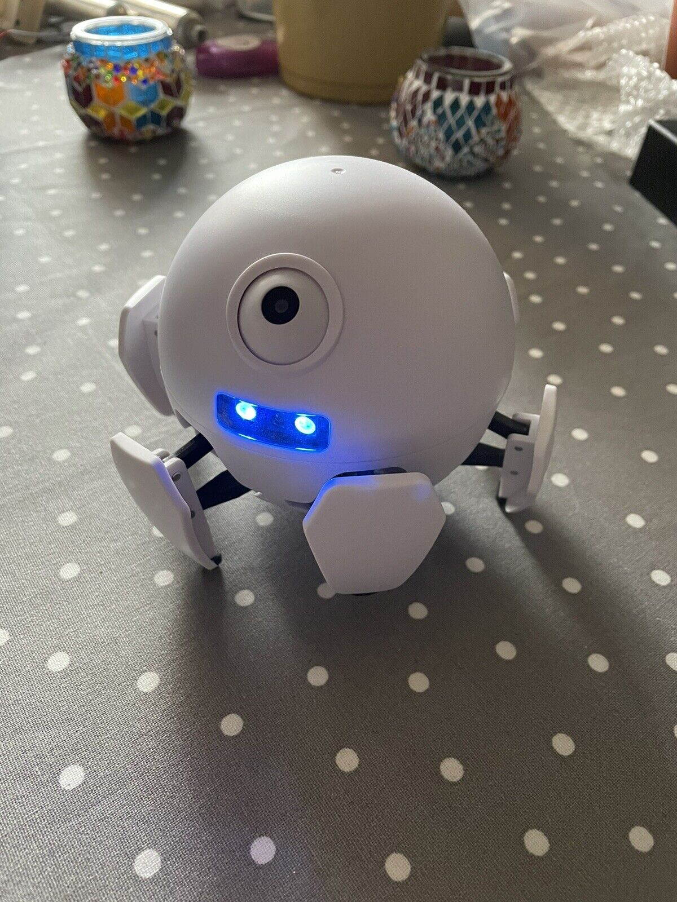

# Kame

## Requirements:

- Phone: Arduino ESP Bluetooth - Dabble app
- 3D printer
- ESP32 mini
- Arduino IDE

### Examples
- [Xpider design](https://www.youtube.com/watch?v=K1jtuKZg11o)
- 

### Project pages and resources
- [Thingiverse: Xpider Ballsy](https://www.thingiverse.com/thing:1704879)
- [Cults3D: Xpider Ballsy](https://cults3d.com/en/3d-model/game/xpider-code-name-ballsy)
- [Facebook: Xpider](https://www.facebook.com/smallxpider/)
- [Xpider cutest robot](https://www.indiegogo.com/projects/xpider-world-s-cutest-spider-robot#/)
- [Xpider parts, description](https://hackaday.io/project/18149-xpider-worlds-cutest-spider-robot)
- [Xpider-E(original name QPAKO)](https://community.robotshop.com/forum/t/xpider-e-original-name-qpako-my-1st-walking-creature/31423)
- [instructables.com: Ballsy instructions](https://www.instructables.com/Xpider-the-Smallest-Smart-Robot-Spider-in-the-Worl/)

### Basic info

* Actuators / output devices: 2 motors, one servo
* Control method: Bluetooth, WiFi, Phone, Web browser
* Operating system: Linux
* Power source: 7.4V Lipoly
* Programming language: C++, C, javascript
* Sensors / input devices: IR, ultrasonic, camera
* Target environment: indoor, outdoor, anywere not near water

### Seznam materialu a soucastek k tisku
#### STL list
- [ ] Vse ve slozce v Hobby/Robotika/Xpider-Ballsy

#### Screws, tools, ...
- [ ] 30x M1,6\*12mm
- [ ] (mini?) NodeMCU-32S ESP32 WiFi + Bluetooth
- [ ] Baterie Lipol 600 MAh
- [ ] TB6612FNG Dual H-Bridge motor driver
- [ ] 2x N20 300 RPM motor (Bez encoderu!)
- [ ] Adafruit PowerBoost 500C
- [ ] 

