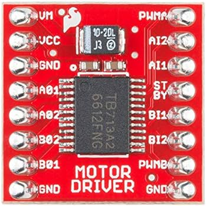
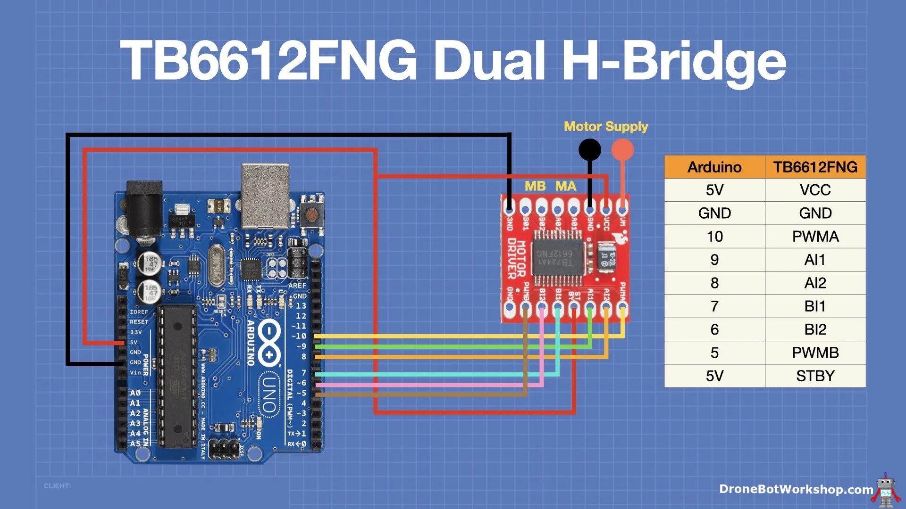
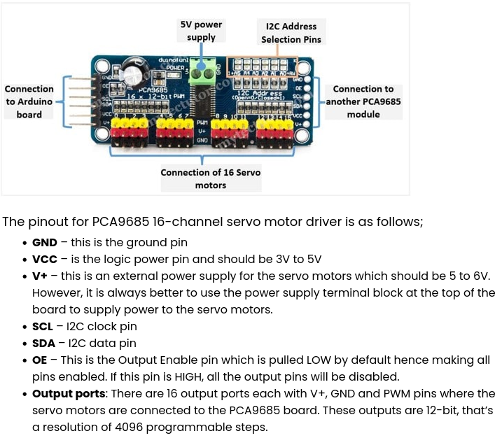
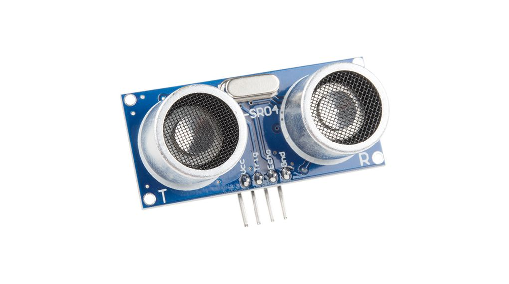
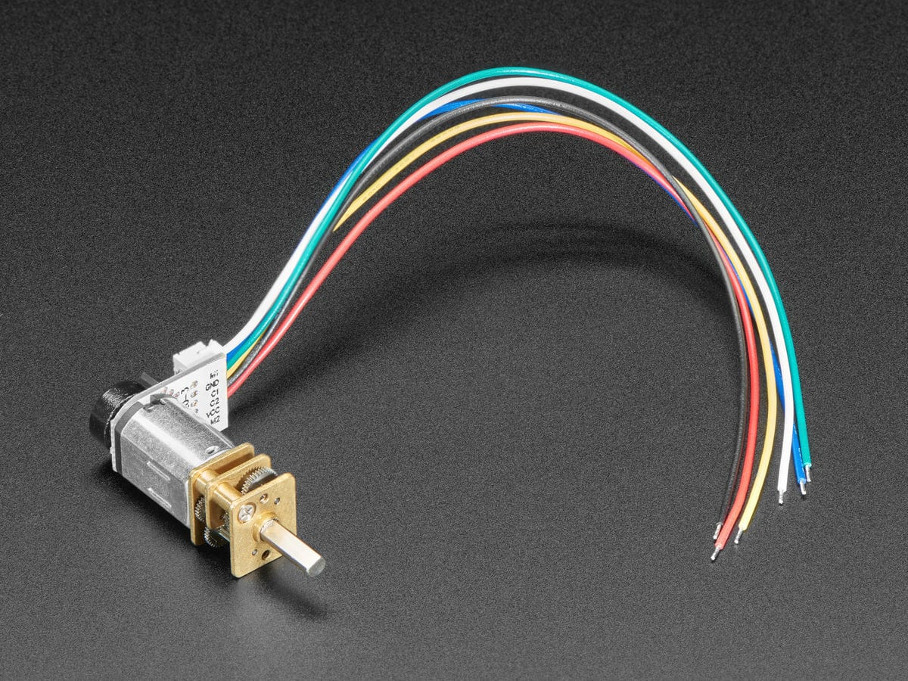
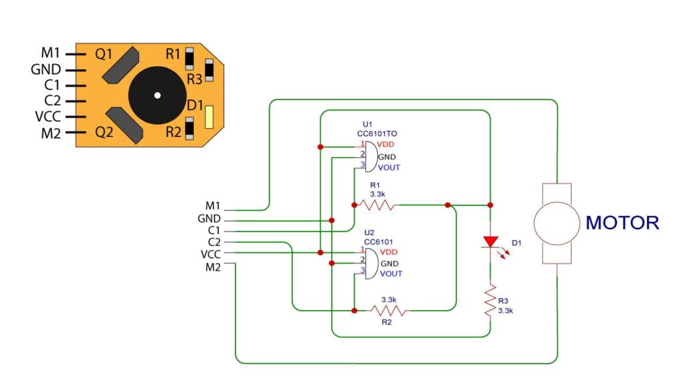
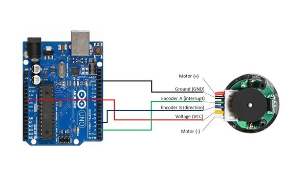

Microcontrollers Documentation and Notes

**Rejstrik**:

- [1. Microcontrollers](#1-microcontrollers)
  - [1.1. Vyvojove prostredi, relevantni aplikace](#11-vyvojove-prostredi-relevantni-aplikace)
  - [1.1. NodeMCU](#11-nodemcu)
    - [1.1.1. ESP8266](#111-esp8266)
    - [1.1.2. ESP32](#112-esp32)
  - [1.2. Arduino](#12-arduino)
    - [1.2.1. Nano](#121-nano)
  - [1.3. Raspberry Pi](#13-raspberry-pi)
    - [1.3.1. Pico W](#131-pico-w)
    - [1.3.2. Pi 4B](#132-pi-4b)
- [2. How to:](#2-how-to)
  - [2.1. Installing Libraries](#21-installing-libraries)
    - [2.1.1. ESP libraries](#211-esp-libraries)
    - [2.1.2. Install and select ESP8266 into Arduino IDE](#212-install-and-select-esp8266-into-arduino-ide)
- [3. Elektronicke soucastky, zapojeni a schemata](#3-elektronicke-soucastky-zapojeni-a-schemata)
  - [3.1. DC Motor Drivers](#31-dc-motor-drivers)
    - [3.1.1. TB6612FNG Dual H-Bridge](#311-tb6612fng-dual-h-bridge)
  - [3.2. Servo Drivers](#32-servo-drivers)
    - [3.2.1. PCA9685 (16-channel PWM)](#321-pca9685-16-channel-pwm)
  - [3.3. Sensors](#33-sensors)
    - [3.3.1. Gyroskopy](#331-gyroskopy)
    - [3.3.2. Distance](#332-distance)
      - [3.3.2.1. Senzor vzdalenosti HC-SR04](#3321-senzor-vzdalenosti-hc-sr04)
    - [3.3.3. Obstacles](#333-obstacles)
  - [3.4. LiPo Baterie, zapojeni a nabijeni](#34-lipo-baterie-zapojeni-a-nabijeni)
  - [3.5. Motory](#35-motory)
    - [3.5.1. Servo motory](#351-servo-motory)
    - [3.5.2. Analog Feedback Servo](#352-analog-feedback-servo)
    - [3.5.3. DC N20 motor with encoder](#353-dc-n20-motor-with-encoder)
- [X. Schemata](#x-schemata)
- [4. Troubleshooting](#4-troubleshooting)
  - [4.1. Random characters in Serial Output Monitor](#41-random-characters-in-serial-output-monitor)
  - [4.2. Cannot open /dev/ttyUSB0: Permission denied](#42-cannot-open-devttyusb0-permission-denied)
  - [4.3. ESP8266 cant be found in the MC selection](#43-esp8266-cant-be-found-in-the-mc-selection)

<!------------------------------------------------------------------------------->
## 1. Microcontrollers

Poznamky o microcontrollerech, jejich vyhody a nevyhody jednoho oproti druhemu, odkazy a zdroje.

### 1.1. Vyvojove prostredi, relevantni aplikace

- Arduino IDE 2.0
- Thonny

### 1.1. NodeMCU

- Levnejsi a vykonnejsi nez arduino

#### 1.1.1. ESP8266

- Nema Bluetooth
- Lack of security

#### 1.1.2. ESP32

- [Intro to the ESP32 - Setup, Docs](https://makeabilitylab.github.io/physcomp/esp32/esp32.html#important-notes)
- Bluetooth, Wifi
- Lepsi verze nez ESP8266
- Vykonnejsi nez ESP8266
- Better security

### 1.2. Arduino

- Podobne funkce jako NodeMCU a Raspberry Pico
- Nema Bluetooth a Wifi

#### 1.2.1. Nano

### 1.3. Raspberry Pi

- flask, python, ssh
- Wifi, Bluetooth

#### 1.3.1. Pico W

- Programovano v (mikro-)Pythonu

#### 1.3.2. Pi 4B

- Wifi, Bluetooth
- Linux - SSH, ...

<!------------------------------------------------------------------------------->
## 2. How to

### 2.1. Installing Libraries

#### 2.1.1. ESP libraries

1. Download zip of the repos: (github -> code -> Download ZIP)
    - ESP32:
        - https://github.com/me-no-dev/ESPAsyncWebServer
        - https://github.com/me-no-dev/AsyncTCP
    - ESP8266
        - https://github.com/me-no-dev/ESPAsyncWebServer
        - https://github.com/me-no-dev/ESPAsyncTCP

2. Include downloaded libraries

    ```
    Sketch > Include Library > Add .zip Library and select the libraries
    ```

#### 2.1.2. Install and select ESP8266 board in Arduino IDE

1. Then we need to add the ESP8266 to the **Boards** list.

    ```
    Open the Arduino IDE Preferences panel.
    On Windows: "File->Preferences"
    On Mac: "Arduino->Preferences..."
    ```

2. Add the following URL to the "Additional Boards Manager URLs":
    - http://arduino.esp8266.com/stable/package_esp8266com_index.json

3. Board Manager (Second from top) -> Type "ESP8266" and click install

<!------------------------------------------------------------------------------->
## 3. Elektronicke soucastky, zapojeni a schemata

### 3.1. DC Motor Drivers

- https://dronebotworkshop.com/dc-motor-drivers/

#### 3.1.1. TB6612FNG Dual H-Bridge




#### 3.1.2. L298N

#### 3.1.3. DRV8871

#### 3.1.4. DBH-12

### 3.2. Servo Drivers

#### 3.2.1. PCA9685 (16-channel PWM)



##### **Popis**

The PCA9685 module is a 16-channel controller that can control 16 PWM outputs via I2C communication. Among other things, it allows you to free up inputs and outputs of your microcontroller and drive up to 16 LEDs or servomotors (or any other module taking a PWM signal as input) using two pins (SCL and SDA) while keeping the pins of your microcontroller for other modules such as sensors.

The module is based on the PCA9685 controller, which allows PWM outputs to be controlled using I2C communication and an integrated clock. The module has 6 bridges to select the address of the board and thus allow up to 62 controllers to be placed on the same bus for a total of 992 servomotors (addresses available **0x40 to 0x7F**).

It can drive PWM outputs with adjustable frequency and 12-bit resolution. The module is compatible with 5V and 3.3V microcontrollers.

##### **Napajeni**

The Servo Driver board uses I2C protocol to communicate with the Pi4. This uses the set of pins down either end of the board to connect to the I2C pins on the Pi4. It operates at 3.3V.

A separate power supply to the board must be used for the servos operating at 5V. This needs to be powerful enough to source sufficient current for the number of servos connected. Each board can support up to 16 servos. This project used 3 servos, each with a maximum current of 140mA   (140mA x 3 = 420mA) so a 1A supply was used.

Do not connect the V+ pin on the ends of the servo board to the 3.3 pin on the Pi4 or you will damage your Pi4!

##### **How does PWM controlling works**

The servos in this project use a PWM signal of varying pulse duration to control the position of the servo motor.

The code example uses the Python SMBus module which is included with the default Raspbian install. This is used to send a series of bytes using I2C protocol to the servo driver’s PCA9685 chip registers. By setting the various registers the board modulates the PWM signal to each server and sets its position.

The servo datasheet shows that the servos operate at a PWM frequency of 50Hz (20ms pulse frequency). A pulse duration of 1.5ms is required for the Standard & Continuous servos to set the centre position.

Initially the board PWM frequency pre-scale register is set to 50Hz using the equation from the PCA9685 datasheet for an Oscillator Clock of 25MHz. (25MHz / (4096 x 50Hz)) – 1 = 122 (0x7A).

**Note:** An oscilloscope was used to tweak this value to exactly 50Hz so a value of 0x08 is used.

##### **Calculation of the speed**

Servo go as fast as they can to the set point you give them, so you don't control how fast they get there. but you can control timing by taking smaller steps as explained above.

If you want to move from angle A to angle B (>A) you have B-A degrees to turn. if you want to take those steps in N seconds, then (assuming moving 1° is almost instantaneous) you can make 1° steps and pause for 1000UL* N / (B-A-1) (ms) in between steps eg. for going from 10° to 61° you have 51° to move and say you want to get there in ~10 seconds. You take 50 steps of 1° and pause for 1000*10/50 = 200ms in between steps

Servo pulse timing varies so you need to find the minimum and maximum for your specific servo (at 0° and 180° — carefully adjust as hitting the physical limits of travel can damage your servo / the gears)

Once you have that, then to go to a specific angle in degrees between 0 and 180, you can use

```c
pulselength = map(angle, 0, 180, SERVOMIN, SERVOMAX);
```

##### **Useful source code**

- Adafruit - Servokit

```bash
sudo pip3 install adafruit-circuitpython-servokit
```

- C library

```c
#include <Adafruit_PWMServoDriver.h>
```

- Addressing multiple chained servos

```c
Adafruit_PWMServoDriver myServo1 = Adafruit_PWMServoDriver(0x40);
Adafruit_PWMServoDriver myServo2 = Adafruit_PWMServoDriver(0x41);
Adafruit_PWMServoDriver myServo3 = Adafruit_PWMServoDriver(0x4A);
```

- Continuous rotation servos using 'throttle'

```python
kit.continuous_servo[1].throttle = 1
```

- Useful servo functions (PCA9685 breakout, Python and ServoKit!)

```python
from adafruit_servokit import ServoKit
kit.servo[0].set_pulse_width_range(1000, 2000)
servokit.servo[0].actuation_range = 160
```

##### **Resources**

- [PCA9685 Datasheet](https://cdn-shop.adafruit.com/datasheets/PCA9685.pdf)
- https://learn.adafruit.com/16-channel-pwm-servo-driver?view=all
- https://mytectutor.com/how-to-use-pca9685-16-channel-12-bit-pwm-servo-driver-with-arduino/

### 3.3. Sensors

#### 3.3.1. Gyroskopy

#### 3.3.2. Distance

##### 3.3.2.1. Senzor vzdalenosti HC-SR04



#### 3.3.3. Obstacles

- Infracerveny detekcni modul prekazek

### 3.4. LiPo Baterie, zapojeni a nabijeni

#### 3.4.1. Adafruit MicroLipo

- is **just** for battery charging !!!

#### 3.4.2. Adafruit PowerBoost 500C and 1000C

- Lze pouzit pro napajeni Rpi, Arduina a pod.

### 3.5. Motory

#### 3.5.1. Servo motory

#### 3.5.2. Analog Feedback Servo

#### 3.5.3. DC N20 motor with encoder



- Despite the size, large torgue
- precise movement!
- micro metal gear motors come in two models - with encoder and without encoders
- motors come in various RPM configurations
- Have to use motor driver, we cannot directly connect motor to the arduino pins

##### **Interni Popis Encoderu**


, kde

- Q1 & Q2 – CC6101 hall effect sensor
- R1, R2, R3 – 3.3Kohm Resistor
- D1 – LED

> Above is the internal circuit diagram of Encoder of N20 micro metal gear motor
> as you can see Two C6101 hall effect sensors are placed diagonally to the circular magnet
> and this magnet is fixed on the rear shaft of the moto as motor rotates the magnet will also rotate
> and hall effect sensor detect the motion of the magnet and generate output at terminal C1 & C2

a hlavne 6 Pinu enkoderu:

- **M1 & M2 pins** – are the motor power terminals the positive and negative supply to this terminal will decide the direction of the rotation of motor
- **C1 pin (Encoder A)** – of the motor connects to (eg. pin 2) of the Arduino. (eg. Pin 2) of the Arduino will record every time there is a rising digital signal from Encoder A.
- **C2 pin (Encoder B)** - of the motor connects to (eg. pin 4) of the Arduino. The signal that is read off (eg. pin 4) on the Arduino will determine if the motor is moving forward or in reverse.
- **VCC pin** – is 5V supply of encoder. Connected to eg arduino.
- **GND pin** – is the system ground, usually connected to arduino's GND.

##### **How to calculate the angular velocity**

- Also known as: magnitude and direction of rotation in radians per second
- Knowing the **angular velocity of wheels** on a robot helps us calculate **how fast the robot is moving** (i.e. speed) as well as the **distance a robot has traveled** in a given unit of time. This information is important for helping us determine where a robot is in a particular environment (i.e. **odometry**).

```math
Let GearRation = 120:1
Encoder pulse per revolution = 8
One rotation of output shaft = Encoder pulse per revolution X Gear Ratio
So pulse per one rotation = 8 X 120 = 960 Pulse per revolution.
```

##### **Connection to controller**



- For this project, you don’t need to connect the motor pins (+ and – terminals) to anything since you will be turning the motor manually with your hand.

##### **Resources**

- https://curiores.com/positioncontrol

### 3.6. Kamery

- Pripojeni: MIPI
  - 15 pinu
  - 22 pinu: UZSI nez tech 15

<!----------------------------------------------------------------------------------------------->
## 4. Knihovny

- SparkFun_TB6612.h [DOWNLOAD](https://github.com/sparkfun/SparkFun_TB6612FNG_Arduino_Library/archive/master.zip)
  - Knihovna s funkcemi pro ovladani motorku v robotech - auta a pod.
  - Funkce jako brake(), drive(), back(), right(), ...
- []()

<!----------------------------------------------------------------------------------------------->
## 4. Troubleshooting

### 4.1. Random characters in Serial Output Monitor

Change boud rate in the code to '9600'.


### 4.2. Cannot open /dev/ttyUSB0: Permission denied

1. Toto pomohlo

    ```bash
    sudo su
    cd /
    cd dev
    chown username ttyUSB0
    ```

2. Nevim, jestli neni potreba i toto:

    ```bash
    sudo usermod -a -G dialout $USER
    sudo usermod -a -G uucp $USER
    sudo usermod -a -G tty $USER
    ```

### 4.3. ESP8266 cant be found in the MC selection

- See 2.1.2. Install and select ESP8266 into Arduino IDE
